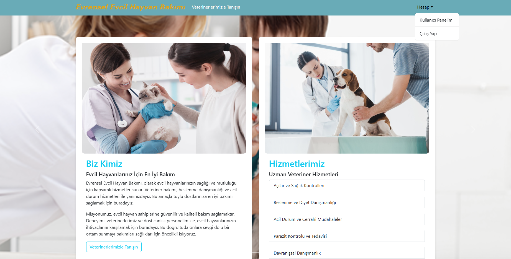
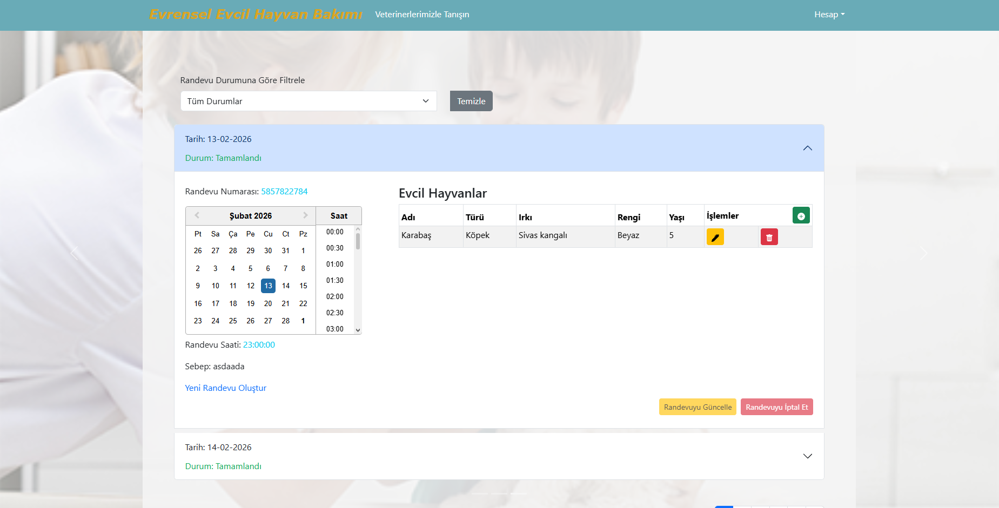
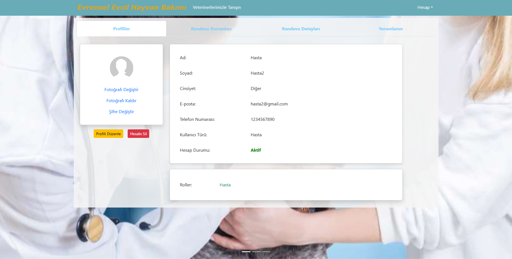

# 🐾 Universal Pet Care - Full Stack Application

**Universal Pet Care**, modern web teknolojileri (Spring Boot & React) kullanılarak uçtan uca geliştirilmiş, kapsamlı bir **Veteriner Randevu ve Evcil Hayvan Bakım Yönetim Sistemidir.** Bu proje, Full-Stack geliştirme süreçlerinin teorik bilgisini pratik ve çalışan bir ürüne dönüştürmek amacıyla tasarlanmış, veritabanından kullanıcı arayüzüne kadar tüm katmanlarıyla başarıyla hayata geçirilmiştir.

## 📸 Ekran Görüntüleri

_(Projenin arayüzüne ait görseller)_

## 🚀 Kullanılan Teknolojiler

**Backend (API & Veritabanı Yönetimi):**

- Java
- Spring Boot (RESTful API Mimarisi)
- Spring Security (JWT Tabanlı Kimlik Doğrulama)
- Spring Data JPA / Hibernate
- MySQL

**Frontend (Kullanıcı Arayüzü):**

- React.js
- Axios (Asenkron API İstekleri)
- Component Tabanlı Modern UI/UX Tasarımı

## ✨ Temel Özellikler

- 🧑‍⚕️ **Kapsamlı Rol Yönetimi:** Veteriner hekimler ve evcil hayvan sahipleri için özelleştirilmiş, yetkilendirme gerektiren güvenli paneller.
- 📅 **Dinamik Randevu Sistemi:** Evcil hayvan sahiplerinin kolayca randevu oluşturabildiği, veterinerlerin ise kendi takvimlerini yönetebildiği akıllı modül.
- 🔒 **Uçtan Uca Güvenlik:** Spring Security entegrasyonu ile veri iletişiminde tam güvenlik.
- 📱 **Kullanıcı Dostu Arayüz:** React'in gücüyle geliştirilmiş, hızlı tepki veren (responsive) ve modern web standartlarına uygun, temiz tasarım.

## 🛠️ Kurulum ve Çalıştırma

Projeyi lokal ortamınızda test etmek veya incelemek için aşağıdaki adımları izleyebilirsiniz:

1. Repoyu bilgisayarınıza klonlayın:
   `git clone https://github.com/rafettcelikk/Universal-Pet-Care-Full-Stack.git`
2. **Backend:** Kendi MySQL veritabanınızı oluşturun, `src/main/resources/application.properties` dosyasındaki bağlantı ayarlarını güncelleyin ve projeyi derleyip ayağa kaldırın.
3. **Frontend:** Terminal üzerinden frontend klasörüne geçiş yapın. Önce `npm install` komutu ile gerekli bağımlılıkları yükleyin, ardından `npm run dev` komutu ile kullanıcı arayüzünü başlatın.
